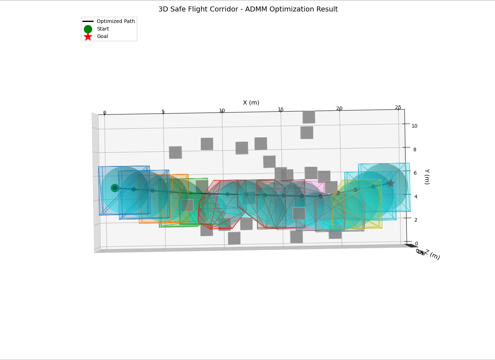
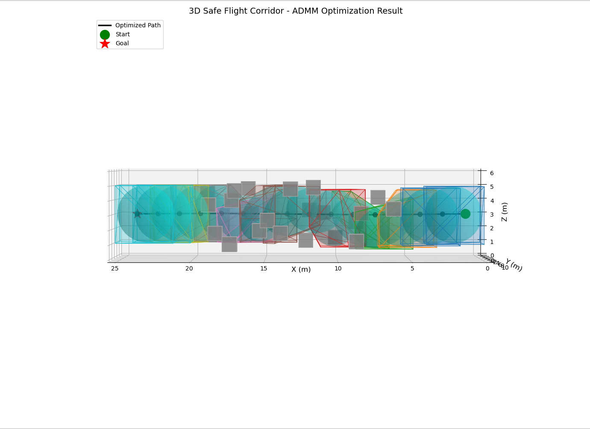
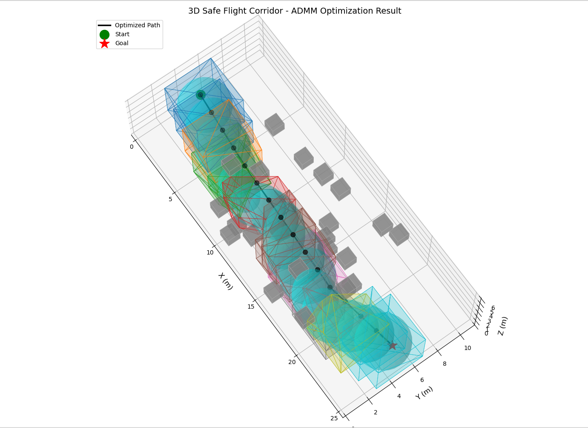

# Safe Flight Corridor (SFC) Planner

A 3D path planning library for quadrotors that generates collision-free flight corridors using ADMM optimization and IRIS polytope inflation.

## Features

- **A* Path Planning**: Finds initial collision-free path through 3D obstacle field
- **IRIS Polytope Inflation**: Creates safe convex regions around the path
- **ADMM Optimization**: Jointly optimizes waypoints and ellipsoid shapes
- **3D Visualization**: Matplotlib visualization with collision detection analysis
- **ROS2 Compatible**: Integrated with ROS2 workspace structure
- **Hardware Ready**: Deployable on VOXL2 ARM64 via Docker

## Demo





## Quick Start (VOXL2 Hardware)

### Prerequisites
1. **Mosek Academic License** (free for students/researchers)
   - Get license: https://www.mosek.com/products/academic-licenses/
   - Place `mosek.lic` in `docker/` directory
   - **Note:** License file is personal - do not commit to Git

### Setup
```bash
# 1. Clone repository
git clone https://github.com/halhalli-s/sfc_planner.git
cd sfc_planner

# 2. Add your Mosek license
cp ~/mosek.lic docker/mosek.lic

# 3. Build Docker image (one-time, ~10 minutes)
cd docker
./build_image.sh

# 4. Run development container
./run_container.sh
# You're now inside container at /home/prance/sfc_planner
```

### Build and Run
```bash
# Inside container
cd build
cmake .. -DCMAKE_BUILD_TYPE=Release \
  -Dcasadi_DIR=/usr/local/lib/python3.10/dist-packages/casadi/cmake
make -j4

# Test standalone
./sfc_planner

# Test ROS2 node
./sfc_ros_node
```

**Expected Performance on VOXL2:**
- Total planning time: **~0.8-1.0 seconds**
- Suitable for real-time flight at 3-5 m/s

---

## Docker Setup

All Docker-related files are in `docker/` directory. The Docker image includes:
- ✅ Ubuntu 22.04 + ROS2 Humble
- ✅ IRIS library (built from source with ARM64 fixes)
- ✅ Mosek 10.1 solver
- ✅ CasADi optimizer
- ✅ Eigen3, libcdd, and all dependencies pre-configured

See [`docker/README.md`](docker/README.md) for detailed Docker documentation.

---

## Development (Laptop/x86)

### Dependencies

- **C++17** or later
- **Eigen3**: Linear algebra library
- **CasADi**: Nonlinear optimization
- **IRIS**: Polytope inflation (requires Mosek)
- **Mosek**: Convex optimization solver
- **Python 3.x**: For visualization
  - matplotlib, numpy, scipy
- **libcdd**: Polytope H-rep to V-rep conversion
- **GMP**: GNU Multiple Precision library

### Install Dependencies (Ubuntu)
```bash
sudo apt update
sudo apt install -y \
    build-essential \
    cmake \
    git \
    libeigen3-dev \
    python3-dev \
    python3-matplotlib \
    python3-numpy \
    python3-scipy \
    libcdd-dev \
    libgmp-dev

# Install CasADi
pip3 install casadi

# Install IRIS and Mosek (see docker/Dockerfile for instructions)
```

### Build Instructions
```bash
# Clone repository
git clone https://github.com/halhalli-s/sfc_planner.git
cd sfc_planner

# Build
mkdir -p build
cd build
cmake .. -DCMAKE_BUILD_TYPE=Release
make -j4

# Run
./sfc_planner
```

---

## Algorithm Overview
```
1. A* Pathfinding → initial waypoints
2. Ellipsoid Initialization → corridor around path
3. Bounding Box Computation → local obstacle detection
4. ADMM Loop:
   - Inflate polytopes (IRIS)
   - Optimize waypoints (minimize path length)
   - Optimize ellipsoids (maximize volume)
   - Update Lagrangian multipliers
5. Validation → ensure obstacle-free corridors
```

---

## Usage
```cpp
#include "safe_flight_corridor.h"

int main() {
    // Create planner
    SafeFlightCorridor sfc;
    
    // Define start and goal
    Eigen::Vector3d start(1.0, 5.0, 3.0);
    Eigen::Vector3d goal(24.0, 5.0, 3.0);
    
    // Set parameters
    MapParams map_params;
    map_params.num_obstacles = 22;
    
    ADMMParams admm_params;
    admm_params.outer_max = 3;
    admm_params.epsilon = 0.3;
    
    // Run planner
    sfc.generate(start, goal, map_params, admm_params);
    
    // Get results
    auto waypoints = sfc.get_waypoints();
    
    // Visualize
    sfc.visualize();
    
    return 0;
}
```

---

## API Reference

### Main Functions

**`SafeFlightCorridor()`**
- Constructor - initializes planner with default parameters

**`void generate(start, goal, obstacles, ADMMParams)`**
- Generates SFC given user-provided obstacles

**`void generate(start, goal, MapParams, ADMMParams)`**
- Generates SFC with random obstacles for testing

**`void visualize()`**
- Opens matplotlib 3D visualization with collision analysis

**`std::vector<Vector3d> get_waypoints()`**
- Returns optimized waypoint positions

**`std::vector<Polytope> get_polytopes()`**
- Returns safe region polytopes (H-representation)

**`bool is_converged()`**
- Returns true if ADMM optimization converged

---

## Parameters

### MapParams
- `resolution`: Grid resolution for A* (default: 0.5m)
- `num_obstacles`: Number of random obstacles (default: 22)
- `map_x/y/z`: Map dimensions (default: 25×11×6m)

### ADMMParams
- `outer_max`: Outer ADMM iterations (default: 3)
- `inner_max`: Inner ADMM iterations (default: 5)
- `rho`: ADMM penalty parameter (default: 1.0)
- `epsilon`: Ellipsoid perpendicular radius (default: 0.3m)

---

## Project Structure
```
sfc_planner/
├── docker/                         # Docker setup for VOXL2
│   ├── Dockerfile
│   ├── build_image.sh
│   ├── run_container.sh
│   └── README.md
├── include/
│   └── safe_flight_corridor.h      # Main header
├── src/
│   ├── main.cpp                    # Test program
│   ├── safe_flight_corridor.cpp    # Core implementation
│   ├── sfc_path.cpp               # A* pathfinding
│   ├── sfc_ellipsoids.cpp         # Ellipsoid initialization
│   ├── sfc_bounding_box.cpp       # Bounding box computation
│   ├── sfc_iris.cpp               # IRIS polytope inflation
│   ├── sfc_admm.cpp               # ADMM optimization
│   └── sfc_visualize.cpp          # Visualization
├── CMakeLists.txt
├── package.xml
└── README.md
```

---

## Validation

The planner automatically validates that all polytopes are obstacle-free:
```
=== POLYTOPE ANALYSIS ===
Polytope 0: 8 faces, 12 vertices
  ✓ Obstacle-free
Polytope 1: 6 faces, 8 vertices
  ✓ Obstacle-free
...
=== SUMMARY ===
✓ ALL POLYTOPES ARE OBSTACLE-FREE!
```

---

## Hardware Performance

### VOXL2 (ARM64)
- **Platform**: ModalAI VOXL2 (Qualcomm QRB5165)
- **Total Time**: 0.8-1.0 seconds
- **A* Planning**: 0.02 sec
- **IRIS Inflation**: 0.40 sec
- **ADMM Optimization**: 0.47 sec
- **Real-time capable**: Yes (up to 5 m/s flight speed)

### Laptop (x86_64)
- Comparable performance: ~0.9 seconds

---

## Related Work

This implementation is based on:
- **IRIS**: Iterative Regional Inflation by Semidefinite programming
- **ADMM**: Alternating Direction Method of Multipliers

---

## Author

**Sachidanand Halhalli**  
Master's Student, Northeastern University  
Advisors: Alireza Ramezani, Adarsh Salagame

---

## License

This project is licensed under the MIT License - see the [LICENSE](LICENSE) file for details.

---

## Citation

If you use this code in your research, please cite:
```bibtex
@software{sachidanand2025sfc,
  title={Safe Flight Corridor Planner},
  author={Sachidanand Halhalli},
  year={2025},
  url={https://github.com/halhalli-s/sfc_planner}
}
```

---

## Acknowledgments

- Advisors: Alireza Ramezani and Adarsh Salagame
- IRIS algorithm developers
- ROS2, Eigen, and CasADi communities